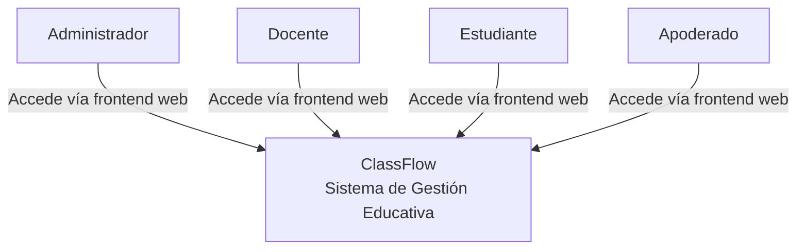
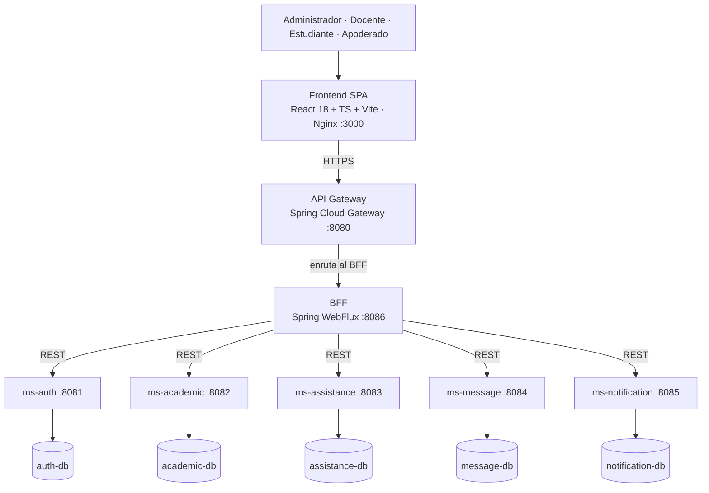
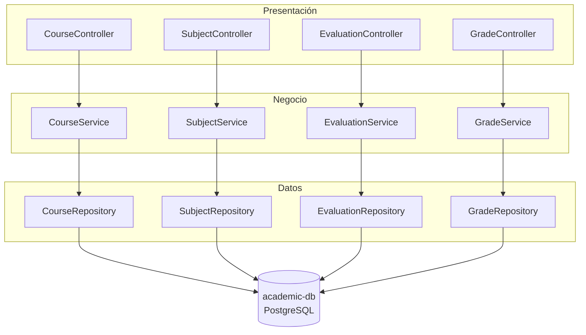

1. Resumen Ejecutivo

ClassFlow es un sistema de gestión educativa desarrollado con arquitectura de microservicios, diseñado para centralizar y automatizar procesos académicos como administración de usuarios, cursos, evaluaciones, asistencia, mensajería y notificaciones. El proyecto está compuesto por un frontend en React 18 + TypeScript + Vite y un backend distribuido en **siete servicios Java** (Spring Boot 3.5.14, JDK 25): cinco microservicios de dominio (`ms-auth`, `ms-academic`, `ms-assistance`, `ms-message` y `ms-notification`) más un BFF (Backend-for-Frontend) reactivo y un API Gateway. Estos servicios se orquestan localmente con Docker Compose y son desplegables en Kubernetes.

Cada microservicio de dominio gestiona su propia base de datos PostgreSQL con migraciones versionadas mediante Flyway. El frontend nunca consume los microservicios de forma directa: su única interfaz con el backend es el BFF, expuesto a través del API Gateway, que consolida en una sola respuesta los datos que cada portal necesita. El frontend implementa portales diferenciados por rol (administrador, docente, estudiante y apoderado) con autenticación basada en JWT. El proyecto incluye datos semilla para usuarios, cursos (1° Básico a 4° Medio), evaluaciones y asistencias, cobertura de pruebas unitarias (44 clases de prueba con JUnit 5 y Mockito) y documentación de APIs mediante Swagger/OpenAPI en cada servicio.

---

2. Arquitectura del Sistema

ClassFlow sigue una arquitectura de microservicios con separación estricta en capas (presentación, negocio, datos). Cada microservicio es independiente, con su propia base de datos, y la comunicación entre ellos ocurre exclusivamente vía REST. El frontend es una SPA en React que se comunica con el backend a través de un API Gateway —único punto de entrada y responsable del transporte (enrutamiento, CORS)— y de un BFF, que es la capa de integración encargada de consolidar los datos de los microservicios antes de responder al frontend.

2.1. Diagrama C1 (Contexto)



El diagrama C1 muestra a ClassFlow como un sistema central con el que interactúan cuatro tipos de actores: el **Administrador**, que gestiona usuarios, cursos y la configuración general del sistema; el **Docente**, encargado de registrar asistencia, calificaciones y anotaciones sobre los estudiantes; el **Estudiante**, que consulta sus notas, asistencias y evaluaciones pendientes; y el **Apoderado**, que supervisa el rendimiento académico y la asistencia de sus pupilos. Los cuatro actores acceden al sistema exclusivamente a través del frontend web, sin comunicación directa con el backend ni con las bases de datos. El sistema se representa como una única caja negra que abstrae toda la complejidad interna (microservicios, bases de datos, gateway, BFF) y expone hacia el exterior únicamente las funcionalidades de autenticación, gestión académica, asistencia, mensajería y notificaciones.

2.2. Diagrama C2 (Contenedores)



El diagrama C2 (Contenedores) descompone ClassFlow en los contenedores que ejecutan el sistema. Los cuatro actores acceden únicamente al **Frontend**, una SPA construida con React 18, TypeScript y Vite, servida a través de Nginx en el puerto 3000. Todas las peticiones del frontend se dirigen al **API Gateway** (Spring Cloud Gateway, puerto 8080), que actúa como único punto de entrada al backend. El gateway enruta las solicitudes del frontend hacia el **BFF** (Backend-for-Frontend, Spring WebFlux, puerto 8086), que es la capa que agrega y consolida los datos de los cinco microservicios de dominio antes de responder. De este modo, el BFF actúa como interfaz única del backend hacia el frontend, mientras los microservicios permanecen aislados detrás de él. Cada microservicio es una aplicación Spring Boot 3.5.14 con JDK 25, y cada uno posee su propia base de datos PostgreSQL 15 dedicada, con las que se comunican vía JDBC. No existen conexiones directas entre bases de datos de diferentes servicios, reflejando el patrón **Database per Service**.

2.3. Diagrama C3 (Componentes — ms-academic)



El diagrama C3 toma como referencia el microservicio `ms-academic` para mostrar la estructura interna que todos los microservicios replican, organizada en tres capas. La **capa de presentación** contiene cuatro controladores REST (`@RestController` con su `@RequestMapping`), que reciben las peticiones HTTP, delegan la lógica a la capa inferior y devuelven respuestas en formato DTO. La **capa de negocio** está compuesta por los servicios correspondientes (`@Service`), donde se implementa la lógica de negocio y la orquestación de llamadas a repositorios. La **capa de datos** incluye los repositorios JPA (que extienden `JpaRepository`) y las entidades JPA, que mapean las tablas de PostgreSQL.

De forma transversal, el `GlobalExceptionHandler` (`@RestControllerAdvice`) captura excepciones de cualquier capa y devuelve respuestas JSON estandarizadas; el `SwaggerConfig` expone la documentación vía OpenAPI; y los DTOs definen los contratos de entrada y salida entre el controller y el cliente. Cada microservicio sigue este mismo patrón, variando solo las entidades y la lógica de negocio según su dominio.

---

3. Estructura del Repositorio

```
classflow/
├── backend/
│   ├── docker-compose.yml          # Orquestación local (14 contenedores)
│   ├── api-gateway/                # Spring Cloud Gateway (8080)
│   │   └── src/main/java/com/ohiggins/classflow/gateway/
│   ├── bff/                        # Backend-for-Frontend (8086)
│   │   └── src/main/java/com/ohiggins/classflow/bff/
│   │       ├── controller/DashboardController.java
│   │       ├── service/DashboardService.java
│   │       ├── security/           # JWT (JwtUtil, JwtWebFilter, SecurityConfig)
│   │       └── config/  dto/  exception/
│   ├── ms-auth/                    # Autenticación y usuarios (8081)
│   │   └── src/main/java/com/ohiggins/classflow/auth/
│   │       ├── controller/ service/ repository/ entity/
│   │       ├── dto/ security/ config/ exception/
│   │       └── resources/db/migration/   # migraciones Flyway
│   ├── ms-academic/                # Cursos, evaluaciones, notas (8082)
│   ├── ms-assistance/              # Asistencia y anotaciones (8083)
│   ├── ms-message/                 # Mensajes y anuncios (8084)
│   ├── ms-notification/            # Notificaciones (8085)
│   └── k8s/                        # Manifiestos de Kubernetes
│       ├── namespace.yml  secret.yml  configmap.yml
│       ├── api-gateway.yml  bff.yml  frontend.yml  ms-*.yml
│       ├── ingress-traefik.yml
│       └── databases/              # StatefulSet + PVC por BBDD
└── frontend/                       # React 18 + TypeScript + Vite
    └── src/
        ├── pages/                  # Login, AdminDashboard, TeacherAccountPage,
        │                           # StudentDashboardPage, GuardianDashboardPage
        ├── services/ context/ hooks/ components/
        ├── router/index.tsx        # Rutas protegidas por rol
        └── config/ constants/ types/ utils/ styles/
```

Cada microservicio dentro de `backend` sigue la misma convención: su nombre empieza con `ms-` (excepto `bff` y `api-gateway`), incluye `Dockerfile`, `pom.xml` y `README.md` propios, y su código fuente se organiza bajo `src/main/java/com/ohiggins/classflow/{artefacto}/`. Las migraciones Flyway residen en `src/main/resources/db/migration/`. El frontend está íntegramente en TypeScript, con tipado estricto y alias de importación configurados en `tsconfig.json`.

---

4. Microservicios

ClassFlow está compuesto por **cinco microservicios de dominio**, más un BFF y un API Gateway (siete servicios en total). Cada uno es una aplicación Spring Boot 3.5.14 con JDK 25, con empaquetado en JAR y despliegue mediante Docker.

| Servicio | Artefacto | Package base | Puerto | BD propia | Rol principal |
|---|---|---|:---:|---|---|
| Auth | `ms-auth` | `com.ohiggins.classflow.auth` | 8081 | `auth-db` | Autenticación JWT, CRUD de usuarios (4 roles) |
| Academic | `ms-academic` | `com.ohiggins.classflow.academic` | 8082 | `academic-db` | Cursos, asignaturas, evaluaciones, calificaciones |
| Assistance | `ms-assistance` | `com.ohiggins.classflow.assistance` | 8083 | `assistance-db` | Asistencia diaria y anotaciones de estudiantes |
| Message | `ms-message` | `com.ohiggins.classflow.message` | 8084 | `message-db` | Mensajería entre usuarios y anuncios por curso |
| Notification | `ms-notification` | `com.ohiggins.classflow.notification` | 8085 | `notification-db` | Notificaciones por email y alertas del sistema |
| BFF | `bff` | `com.ohiggins.classflow.bff` | 8086 | — | Agregación de datos para los dashboards del frontend |
| Gateway | `api-gateway` | `com.ohiggins.classflow.gateway` | 8080 | — | Enrutamiento, punto de entrada único, CORS |

**Dependencias comunes** a todos los servicios con base de datos: `spring-boot-starter-web`, `spring-boot-starter-data-jpa`, `springdoc-openapi`, `flyway-core` + `flyway-database-postgresql`, Lombok, el driver de PostgreSQL y H2 (para desarrollo local).

**Casos particulares:**

- `ms-auth` añade `spring-boot-starter-security`, `jjwt` (JWT) y `BCryptPasswordEncoder`.
- `bff` usa `spring-boot-starter-webflux` (reactivo) en vez de `spring-boot-starter-web`, e incorpora validación de JWT propia.
- `api-gateway` usa `spring-cloud-starter-gateway` (reactivo) y no tiene base de datos.

**Comunicación entre servicios.** Toda ocurre vía REST síncrono. El frontend nunca se comunica directamente con los microservicios; lo hace siempre a través del API Gateway, que enruta hacia el BFF. El BFF, a su vez, consulta a los microservicios de datos para consolidar las respuestas del dashboard. No existe comunicación directa entre microservicios de dominio.

---

5. Patrón Database per Service

Cada microservicio con estado gestiona su propia base de datos PostgreSQL, sin compartir esquemas ni tablas con otros servicios. Esta decisión se materializa en `docker-compose.yml` con cinco contenedores de base de datos independientes.

| Microservicio | Base de datos | Usuario | Volumen persistente |
|---|---|---|---|
| `ms-auth` | `auth-db` | `auth-user` | `auth-postgres-data` |
| `ms-academic` | `academic-db` | `academic-user` | `academic-postgres-data` |
| `ms-assistance` | `assistance-db` | `assistance-user` | `assistance-postgres-data` |
| `ms-message` | `message-db` | `message-user` | `message-postgres-data` |
| `ms-notification` | `notification-db` | `notification-user` | `notification-postgres-data` |

**Reglas del patrón aplicadas:**

- **Aislamiento total.** Ningún microservicio accede directamente a la base de datos de otro. La única forma de obtener datos de otro dominio es mediante llamadas REST a través del API Gateway o desde el BFF. No hay claves foráneas entre tablas de diferentes bases de datos, ni consultas entre servicios.
- **Migraciones versionadas con Flyway.** Cada microservicio gestiona su propio esquema mediante archivos SQL versionados. Al iniciar, Flyway aplica las migraciones pendientes automáticamente. En total son 17 migraciones distribuidas entre los cinco servicios.
- **Dos perfiles de ejecución.** En el perfil `default` (local sin Docker) los servicios usan H2 en memoria; en el perfil `docker` se conectan a sus contenedores PostgreSQL con las credenciales definidas en variables de entorno.
- **Volúmenes persistentes.** Cada base de datos tiene su propio volumen Docker nombrado, que garantiza que los datos sobrevivan a reinicios. Con `docker compose down -v` los volúmenes se eliminan y las migraciones se re-ejecutan desde cero.

---

6. Frontend

El frontend de ClassFlow es una Single Page Application (SPA) construida con React 18, TypeScript 5.3 y Vite como bundler, con una estructura modular y separación clara de responsabilidades. Utiliza `react-router-dom` para el enrutamiento del lado del cliente; todas las rutas están protegidas mediante el componente `ProtectedRoute`, que verifica el rol del usuario autenticado antes de renderizar cada página.

| Ruta | Componente | Rol requerido |
|---|---|---|
| `/dashboard/admin` | `AdminDashboard` | ADMINISTRATOR |
| `/dashboard/teacher` | `TeacherAccountPage` | TEACHER |
| `/dashboard/student` | `StudentDashboardPage` | STUDENT |
| `/dashboard/guardian` | `GuardianDashboardPage` | GUARDIAN |
| `/login` | `LoginPage` | Público |
| `/access-denied` | `AccessDeniedPage` | Todos |

**Conexión con el backend.** El frontend nunca se comunica con los microservicios de dominio de forma directa: su única interfaz con el backend es el BFF, expuesto a través del API Gateway. El **API Gateway** es el único punto de entrada y se encarga del transporte (enrutamiento por path, CORS), sin lógica de negocio. El **BFF** es la capa de integración: por cada vista del frontend consulta en paralelo a los microservicios que necesita y devuelve una única respuesta ya consolidada. El flujo de datos de los dashboards es:

```
Frontend → API Gateway → BFF → microservicios → BFF consolida → Frontend
```

El frontend desconoce la existencia de los microservicios individuales; siempre dialoga con el BFF mediante `axios`.

**Autenticación.** El login envía credenciales a `/api/auth/login`, que devuelve un token JWT. El token se almacena en `localStorage` y se envía en el header `Authorization: Bearer <token>` en cada petición posterior. El `AuthContext` mantiene el estado global del usuario autenticado y expone `login()`, `logout()` y `validate()`.

**Portales por rol.**

- **AdminDashboard:** panel administrativo completo con CRUD de usuarios y cursos, estadísticas, asistencias por curso y alertas. Consume datos reales del BFF mediante el hook `useDashboardData()`.
- **TeacherAccountPage:** portal docente con vista de cursos, asistencia, anotaciones y calificaciones. También consume datos reales del BFF.
- **StudentDashboardPage:** panel del estudiante con calificaciones, asistencias y evaluaciones próximas, filtradas por su propio ID; los cursos se acotan a su grado.
- **GuardianDashboardPage:** panel del apoderado con información consolidada de los estudiantes a su cargo.

**Estilos y dependencias.** CSS plano con nombres de clases modulares (prefijos por portal, p. ej. `tp-` docente y `sp-` estudiante) y diseño responsivo. Dependencias principales: React 18, `react-dom`, `react-router-dom`, `axios` y TypeScript 5.3 con tipado estricto en `tsconfig.json`.

---

7. Seguridad

ClassFlow aplica controles de seguridad en cada capa del sistema.

- **Autenticación.** `ms-auth` emite tokens JWT firmados tras validar las credenciales. Las contraseñas nunca se almacenan en texto plano: se cifran con **BCrypt** antes de persistirse. El token viaja en el header `Authorization: Bearer <token>` en cada petición.
- **Autorización.** El BFF valida el JWT antes de servir cualquier dato, mediante un filtro de seguridad reactivo (`JwtWebFilter`) y `SecurityConfig`; las peticiones de escritura sin token válido reciben `401`. En el frontend, `ProtectedRoute` restringe cada ruta según el rol, redirigiendo a `/access-denied` cuando corresponde.
- **Transporte.** En producción (Kubernetes), el Ingress (Traefik) termina **TLS** y el API Gateway centraliza la política de **CORS**.
- **Gestión de secretos.** Ninguna credencial se incluye en el código fuente ni en el repositorio. Las variables sensibles (`JWT_SECRET`, credenciales de base de datos, credenciales de correo) se inyectan por variables de entorno: en local mediante un archivo `.env` excluido del control de versiones (`.gitignore`), y en Kubernetes mediante **Secrets** y **ConfigMaps**. El mismo `JWT_SECRET` se comparte entre el emisor (`ms-auth`) y el validador (BFF) por configuración, nunca embebido en el código. Las credenciales semilla son exclusivamente para demostración local.

---

8. Infraestructura

ClassFlow se despliega en dos entornos diferenciados: local (desarrollo) y Kubernetes (producción).

### 8.1. Local (Docker Compose)

El archivo `docker-compose.yml` orquesta 14 contenedores en una red bridge llamada `classflow-back-net`:

| Tipo | Contenedores |
|---|---|
| Bases de datos | `auth-db`, `academic-db`, `assistance-db`, `message-db`, `notification-db` (PostgreSQL 15 Alpine) |
| Microservicios | `ms-auth`, `ms-academic`, `ms-assistance`, `ms-message`, `ms-notification` (Spring Boot 3.5.14, JDK 25) |
| Infraestructura | `api-gateway` (Spring Cloud Gateway, 8080), `bff` (Spring WebFlux, 8086) |
| Frontend | `frontend` (Nginx, 3000) |

Cada base de datos incluye un healthcheck con `pg_isready` para que los microservicios esperen a que la base esté lista antes de iniciar. Los microservicios y el frontend también tienen healthcheck vía `/actuator/health`. Los volúmenes nombrados aseguran la persistencia de datos entre reinicios. Las variables de correo del servicio de notificaciones se cargan desde un archivo `.env` que no se versiona.

8.2. Kubernetes

El clúster aloja 12 pods en el namespace `classflow`: 5 bases de datos PostgreSQL, 5 microservicios, 1 BFF, 1 API Gateway y 1 frontend Nginx. Cada microservicio se despliega como un `Deployment` (≥1 réplica) con un `Service` de tipo `ClusterIP` para la comunicación interna. Las bases de datos usan `StatefulSet` con almacenamiento persistente (`PersistentVolumeClaim`).

El frontend se sirve al exterior a través de un Ingress Controller (Traefik) que expone el dominio y gestiona el certificado TLS. El tráfico entrante llega al Ingress, que lo redirige al `Service` del API Gateway. El Gateway enruta internamente hacia los `Service` del BFF y de los microservicios usando los nombres DNS internos de Kubernetes (`ms-auth.namespace.svc.cluster.local`). Las credenciales, la clave JWT y las variables específicas se inyectan vía Secrets y ConfigMaps. Las sondas `readinessProbe` y `livenessProbe` sobre `/actuator/health` permiten a Kubernetes gestionar el tráfico y reiniciar pods que fallen.

---

9. Atributos de Calidad

| Atributo | Cómo se aborda en ClassFlow |
|---|---|
| Escalabilidad | Microservicios independientes; cada `Deployment` escala por separado en Kubernetes según la carga. |
| Disponibilidad | Sondas `readinessProbe`/`livenessProbe` sobre `/actuator/health`; Kubernetes reinicia automáticamente los pods que fallen. |
| Mantenibilidad | Separación estricta en capas, DTOs como contratos de interfaz y migraciones de esquema versionadas con Flyway. |
| Seguridad | JWT, cifrado de contraseñas con BCrypt, TLS en el Ingress y secretos gestionados con Secrets (ver §7). |
| Portabilidad | Contenerización completa: los mismos artefactos se ejecutan en local (Docker Compose) y en producción (Kubernetes). |
| Observabilidad | Endpoints de Actuator y documentación OpenAPI por servicio para inspección y diagnóstico. |

---

10. Calidad y Cobertura de Pruebas

El proyecto incluye 44 clases de prueba distribuidas entre los siete servicios, escritas con JUnit 5 y Mockito.

| Servicio | Tests | Capas cubiertas |
|---|:---:|---|
| `ms-auth` | 8 | Controller, Service, Repository, Security (JWT + filtro), ExceptionHandler, SwaggerConfig |
| `ms-academic` | 10 | Controller (4), Service (4), Repository (1), Config |
| `ms-assistance` | 6 | Controller, Service, Repository, Config |
| `ms-message` | 6 | Controller, Service, Repository, Config |
| `ms-notification` | 6 | Controller, Service, Repository, ExceptionHandler, EmailService, SwaggerConfig |
| `api-gateway` | 3 | ExceptionHandler, CorsConfig, SwaggerConfig |
| `bff` | 2 | Controller (con seguridad JWT simulada), Service |

**Estrategia de pruebas:**

- **Controladores.** Se prueban con `@WebMvcTest` y `@MockitoBean` para simular los servicios, validando códigos de estado HTTP, estructura JSON y manejo de errores. Por ejemplo, `AuthControllerTest` verifica login exitoso (200), credenciales inválidas (401) y registro (201).
- **Servicios.** Se prueban con `@ExtendWith(MockitoExtension.class)`, inyectando mocks con `@Mock` e `@InjectMocks`. Se validan reglas de negocio, transformaciones entidad↔DTO y excepciones esperadas.
- **Repositorios.** Se prueban con `@DataJpaTest` sobre H2 en memoria, verificando consultas derivadas y operaciones CRUD básicas.
- **Componentes transversales.** `GlobalExceptionHandlerTest` verifica que las excepciones se traduzcan en respuestas JSON coherentes; `SwaggerConfigTest` confirma que OpenAPI se inicialice sin errores.

---

11. Documentación de APIs

Cada servicio expone su documentación mediante Springdoc OpenAPI, que genera una interfaz Swagger UI navegable.

| Servicio | Dependencia | URL |
|---|---|---|
| `ms-auth` | `springdoc-openapi-starter-webmvc-ui` | http://localhost:8081/swagger-ui.html |
| `ms-academic` | `springdoc-openapi-starter-webmvc-ui` | http://localhost:8082/swagger-ui.html |
| `ms-assistance` | `springdoc-openapi-starter-webmvc-ui` | http://localhost:8083/swagger-ui.html |
| `ms-message` | `springdoc-openapi-starter-webmvc-ui` | http://localhost:8084/swagger-ui.html |
| `ms-notification` | `springdoc-openapi-starter-webmvc-ui` | http://localhost:8085/swagger-ui.html |
| `bff` | `springdoc-openapi-starter-webflux-ui` | http://localhost:8086/swagger-ui.html |
| `api-gateway` | `springdoc-openapi-starter-webflux-ui` | http://localhost:8080/swagger-ui.html |

Los servicios con Spring MVC usan la variante `webmvc-ui`, mientras que el `bff` y el `api-gateway` (reactivos con WebFlux) usan `webflux-ui`. La configuración se realiza mediante una clase `SwaggerConfig` en cada servicio. Adicionalmente, los endpoints incluyen anotaciones `@Operation` y `@ApiResponse` que enriquecen la documentación con descripciones, códigos de respuesta y ejemplos, permitiendo probar cada endpoint desde el navegador sin herramientas externas.

---

12. Manejo de Errores

Cada servicio implementa un manejador global de excepciones mediante `@RestControllerAdvice`, garantizando que todos los errores se capturen en un punto central y se respondan con un formato JSON estandarizado. Los siete servicios incluyen su propia clase `GlobalExceptionHandler` en el paquete `exception/`.

**Excepciones manejadas:**

- **`MethodArgumentNotValidException`** — errores de validación en los DTOs de entrada (campos obligatorios, formato de email, longitud mínima). Devuelve un mapa campo→mensaje con código 400.
- **`RuntimeException`** — errores de negocio como "usuario no encontrado", "email ya registrado" o "credenciales inválidas". Devuelve un objeto con el mensaje y código 400.
- **`Exception`** — en algunos servicios como `ms-notification`, captura errores no contemplados con código 500.

Estructura de la respuesta de error:

```json
{
  "error": "User not found with ID: 999"
}
```

Para errores de validación:

```json
{
  "email": "El email es obligatorio",
  "password": "La contraseña es obligatoria"
}
```

Este enfoque asegura que el frontend reciba errores predecibles y pueda mostrarlos al usuario sin importar qué capa del backend haya fallado.

---

13. Convenciones y Normas

- **Idioma.** El código fuente (clases, métodos, variables) está escrito en inglés; los comentarios explicativos, en español.
- **Paquetes Java.** Estructura `com.ohiggins.classflow.{artefacto}`, en minúsculas y sin guiones:

| Módulo | Package base |
|---|---|
| `ms-auth` | `com.ohiggins.classflow.auth` |
| `ms-academic` | `com.ohiggins.classflow.academic` |
| `ms-assistance` | `com.ohiggins.classflow.assistance` |
| `ms-message` | `com.ohiggins.classflow.message` |
| `ms-notification` | `com.ohiggins.classflow.notification` |
| `bff` | `com.ohiggins.classflow.bff` |
| `api-gateway` | `com.ohiggins.classflow.gateway` |

- **Nombres.** Clases en `PascalCase`, métodos y variables en `camelCase`, constantes en `UPPER_SNAKE_CASE`. Tablas de base de datos en plural y minúsculas (`users`, `courses`, `evaluations`, `grades`).
- **Migraciones Flyway.** Nomenclatura `V{version}__{descripcion}.sql`, con descripción en `snake_case` en inglés (ej. `V1__initial_schema.sql`, `V2__seed_data.sql`).
- **Frontend.** TypeScript en modo estricto (`strict: true`), alias de importación con `@` (`@services`, `@components`, `@pages`) y componentes en archivos `.tsx` con el mismo nombre del componente exportado.

---

14. Conclusiones

La tercera entrega de ClassFlow consolida un sistema funcional de gestión escolar compuesto por siete servicios, cuatro portales diferenciados por rol y una base de 44 clases de prueba unitarias, con un despliegue reproducible tanto en entorno local (Docker Compose) como en producción (Kubernetes). Las dos decisiones de arquitectura centrales —el patrón Database per Service y la incorporación de un BFF como única interfaz del backend hacia el frontend— se validaron en la práctica: el aislamiento de datos simplifica la evolución independiente de cada microservicio, mientras que el BFF reduce el acoplamiento del frontend y la cantidad de llamadas necesarias para construir cada dashboard.

Como trabajo futuro se proponen tres líneas: implementar el módulo de horario (hoy un marcador de posición en el portal del estudiante), incorporar mensajería en tiempo real, y medir la cobertura de pruebas de forma cuantitativa con una herramienta como JaCoCo para establecer umbrales mínimos en el pipeline de integración continua.
